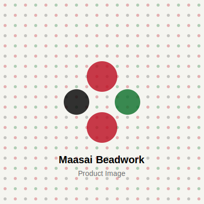

# 🌍 Beadske - Maasai Beadwork E-Commerce

A modern, full-stack e-commerce platform for handcrafted Maasai beadwork jewelry. Built with React, TypeScript, and Sanity CMS.



## ✨ Features

### 🎨 Design
- **Bead-inspired UI** with Kenyan flag color palette
- Minimalist white background with vibrant bead accents
- Smooth animations and hover effects
- Responsive design for all devices
- Accessibility-focused (ARIA labels, contrast ratios)

### 🛍️ E-Commerce
- **14 Products** imported and ready
- Product catalog with filtering (category, color, price)
- Individual product pages with image galleries
- Shopping cart with quantity management
- Stripe payment integration (test mode ready)
- Order checkout flow

### 📝 Content Management
- **Sanity CMS** headless content management
- **6 SEO-optimized blog posts** included
- Product management (14 products)
- Category management (3 categories)
- Order tracking
- Customer database
- Promotions & discounts
- Product reviews
- Site settings
- Real-time editing

### 📈 SEO & Performance
- React Helmet for dynamic meta tags
- Semantic HTML structure
- Optimized images with lazy loading
- Fast load times with Vite
- Sitemap and robots.txt

## 🚀 Tech Stack

### Frontend
- **Framework:** React 18 + TypeScript
- **Build Tool:** Vite
- **Styling:** TailwindCSS
- **Routing:** React Router v6
- **State Management:** Zustand
- **Animations:** Framer Motion
- **Icons:** Lucide React
- **SEO:** React Helmet Async
- **Payments:** Stripe

### Backend
- **CMS:** Sanity.io
- **Content API:** Sanity Client
- **Real-time:** Sanity Studio
- **Image CDN:** Sanity Image URLs
- **Admin:** Sanity Studio Dashboard

## 📦 Installation

### Prerequisites
- Node.js 20+ and npm
- Sanity account (free at sanity.io)

### 1. Clone the Repository
```bash
git clone https://github.com/yourusername/beadske.git
cd beadske
```

### 2. Install Frontend Dependencies
```bash
npm install
```

### 3. Install Sanity Studio Dependencies
```bash
cd sanity-studio
npm install
cd ..
```

### 4. Environment Setup

Create a `.env` file in the root directory:
```env
VITE_SANITY_PROJECT_ID=your_project_id
VITE_SANITY_DATASET=production
VITE_SANITY_API_VERSION=2024-01-01
VITE_STRIPE_PUBLIC_KEY=your_stripe_public_key
```

### 5. Sanity Setup

1. Create a Sanity account at [sanity.io](https://sanity.io)
2. Create a new project
3. Update the environment variables with your project ID
4. Run Sanity Studio:
```bash
cd sanity-studio
npm run dev
```
Visit: http://localhost:3333

## 🎯 Running the Application

### Development Mode

**Terminal 1 - Sanity Studio:**
```bash
cd sanity-studio
npm run dev
```
Sanity Studio runs on `http://localhost:3333`

**Terminal 2 - Frontend:**
```bash
npm run dev
```
Frontend runs on `http://localhost:3001`

### Production Build

**Frontend:**
```bash
npm run build
npm run preview
```

## 🌐 Deployment

### Frontend (Netlify)

1. Install Netlify CLI:
```bash
npm install -g netlify-cli
```

2. Build and deploy:
```bash
npm run build
netlify deploy --prod
```

Or connect your GitHub repository to Netlify for automatic deployments.

### Sanity Studio

Deploy Sanity Studio:
```bash
cd sanity-studio
npx sanity deploy
```

Your studio will be available at: `https://your-project.sanity.studio`

## 📁 Project Structure

```
beadske/
├── public/
│   ├── favicon.ico
│   └── placeholder.svg
├── src/
│   ├── components/
│   │   ├── Cart.tsx
│   │   ├── Footer.tsx (with CodeBizz link)
│   │   ├── Header.tsx
│   │   ├── ProductCard.tsx
│   │   └── ScrollToTop.tsx
│   ├── data/
│   │   └── blogPosts.ts (6 SEO blog posts)
│   ├── lib/
│   │   ├── sanity.ts (Sanity client)
│   │   ├── store.ts (Zustand)
│   │   └── types.ts
│   ├── pages/
│   │   ├── About.tsx
│   │   ├── Blog.tsx
│   │   ├── BlogPost.tsx
│   │   ├── Checkout.tsx
│   │   ├── Contact.tsx
│   │   ├── Home.tsx
│   │   ├── Login.tsx
│   │   ├── Product.tsx
│   │   └── Shop.tsx
│   ├── App.tsx
│   ├── main.tsx
│   └── index.css
├── sanity-studio/
│   ├── schemaTypes/
│   │   ├── product.ts
│   │   ├── category.ts
│   │   ├── order.ts
│   │   ├── customer.ts
│   │   ├── blogPost.ts
│   │   ├── review.ts
│   │   ├── promotion.ts
│   │   └── siteSettings.ts
│   ├── sanity.config.ts
│   └── package.json
├── .env.example
├── package.json
├── tailwind.config.ts
└── vite.config.ts
```

## 🎨 Color Palette

Based on the Kenyan flag:
- **Black (#000000):** Strength and heritage
- **Red (#BB0A1E):** Bravery and passion
- **White (#FFFFFF):** Peace and purity
- **Green (#0A6E29):** Land and prosperity
- **Neutral (#F5F5F0):** Background

## 🔑 Admin Access

Access Sanity Studio:
1. **Local:** http://localhost:3333
2. **Login** with Google or GitHub
3. Manage:
   - Products (14 imported)
   - Categories (3 set up)
   - Blog Posts (6 imported)
   - Orders
   - Customers
   - Reviews
   - Promotions
   - Site Settings

## 📊 What's Included

### Products (14):
- Kenyan Pride Bracelet - $25.00
- Maasai Heritage Necklace - $45.00
- Unity Anklet - $20.00
- Warrior Spirit Bracelet - $30.00
- Heritage Choker - $35.00
- Prosperity Bracelet Set - $55.00
- Maasai Beadwork T-Shirt (Black) - $28.00
- Kenyan Flag T-Shirt - $28.00
- Heritage Beadwork T-Shirt (White) - $28.00
- Warrior Spirit T-Shirt (Green) - $28.00
- Sunset Beaded Bracelet - $22.00
- Savanna Statement Necklace - $58.00
- Tribal Elegance Earrings - $18.00
- Cultural Pride Ankle Bracelet - $16.00

### Blog Posts (6 SEO-optimized):
1. The Hidden Meaning Behind Maasai Beadwork Colors
2. How Authentic Maasai Jewelry is Made
3. 7 Reasons Why Handmade Jewelry is Better
4. Meet the Artisans: Maasai Women Stories
5. Sustainable Fashion: Why Ethical Jewelry Matters
6. How to Style Maasai Beadwork

### Categories (3):
- Jewelry
- Apparel
- Gift Sets

## 🙏 Acknowledgments

- Maasai artisan communities in Kenya
- Traditional beadwork techniques and cultural heritage

## 📄 License

This project is licensed under the MIT License - see the LICENSE file for details.

---

**Crafted with Culture. Worn with Pride.** 🌍❤️
